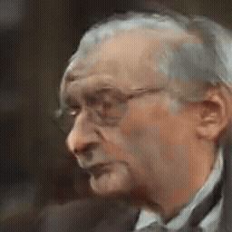

# 👋 Greetings, Traveler!

Welcome, brave soul, to my little corner of GitHub! You’ve wandered far through the digital woods—take a seat, grab a cup of tea 🍵, and stay a while.

    
  
  
  
  

---

## 🧠 A Bit About Me

Hey! I'm Tommy Nguyen—an Associate Software Engineer at **SS&C Eze**, where I work on feature development, workflow optimization, and good old-fashioned bug hunting for our OMS product.

I hold both a **Bachelor’s** and a **Master’s** degree in Computer Science from **Wentworth Institute of Technology**, with a specialization in **AI/ML** during my grad years. During that time, I published several papers and worked on a variety of research projects (shoutout to Professor Ergezer 🥳).

I'm passionate about AI, finance, game development, mathematics, and just about anything that sparks curiosity. If it's new, shiny, and challenging—count me in!

---

## 🧰 Tech Stack
Here are a few of my most commonly used technologies (some, but most definitely not all)!

**Languages:** Python, C#, Java, SQL, JavaScript  
**Frameworks & Libraries:** .NET, Numpy, Scikit-learn, TensorFlow, PyTorch, FastAPI
**Tools:** Git, GitHub, GitHub Actions, VS Code, Unity, Jupyter, Docker  
**Databases:** SQLite, PostgreSQL, Oracle SQL

---

## 🗂️ Featured Projects
The projects below are housed in private repositories, but if you're curious to see them in action, feel free to reach out—I'd be happy to set up a quick demo!

- **🕹️ Zone Zero**  
  A first-person horror stealth game where players must explore a maze, uncover hidden notes, and avoid a lurking, terrifying monster.
  

- **📈 Watcher**  
  A stock monitoring, analysis, and report generation platform that provides short- and long-term forecasts, sentiment analysis on company news, and stock recommendations (buy, hold, or sell).  
  👉 [Check out the LinkedIn post here!](https://www.linkedin.com/posts/tommy-nguyen-_im-excited-to-share-that-my-stock-analysis-activity-7264046354107088896-wGjh?utm_source=share&utm_medium=member_desktop&rcm=ACoAAClSaxEBgNuvUkAK-rZuouH0hF3h37Sr3qE)

  [Here's one example report generated by Watcher!](pdfs/watcher_example.pdf)

- **🤖 Personal Assistant Sebastian (2025)**  
  A fully end-to-end smart assistant using VAD, TTS, and SadTalker. Currently under development—real-time animation is tricky, but I'm working on optimizing it!  
  👉 [Follow the progress on GitHub](https://github.com/Tommy-Nguyen-cpu/SadTalker-CUDA-Optimized)

  
  
  <em>Caption: Failed attempt at optimizing SadTalker, we'll get them next time!</em>

---

## 🏆 Achievements

- 🧠 Presented our paper _"Gaussian Splatting Under Attack: Investigating Adversarial Noise in 3D Objects"_ at **NeurIPS 2024** in Vancouver, Canada! [Check it out on arXiv!](https://arxiv.org/abs/2412.02803)
- 🎯 Our work _"AdvIRL: Reinforcement Learning-Based Adversarial Attacks on 3D NeRF Models"_ was accepted to **AAAI** and presented in Philadelphia!  
  👉 [Read it on arXiv](https://arxiv.org/abs/2412.16213)
- 🕶️ Led the **ACM WIT Student Chapter**, hosted a successful VR Jam event, and collaborated with the Formula E club!

---

## 😄 Fun Facts

- 🐭 I once modeled an entire monster for a game using **just a laptop trackpad**... it was painful.
- 🧠 I love digging deep into how AI works—from classical to generative—which is why I’m revisiting a lot of math (and because I’m a math nerd 🤣).
- 💡 My dream project? A real working Iron Man suit powered by my Sebastian assistant. Longshot, but better dream big, am I right?
- 🛌 Outside of code and AI, I love writing stories, cooking, working out, and… sleeping. Lots of sleeping.

---

## 📫 Let's Connect!

- **LinkedIn:** [Tommy Nguyen](https://www.linkedin.com/in/tommy-nguyen-/)  
- **Email:**  
  - General: `tommyportfoliowit@gmail.com`  
  - Professional/Recruiters: `tnguyen.professional@gmail.com`

---

## 🤝 Open to Collaborate!

Have a project idea? A spooky game? A cool research problem? I’m always happy to connect and collaborate. Drop me a message and let’s build something awesome! 🚀

<!--
**Tommy-Nguyen-cpu/Tommy-Nguyen-cpu** is a ✨ _special_ ✨ repository because its `README.md` (this file) appears on your GitHub profile.

Here are some ideas to get you started:

- 🔭 I’m currently working on ...
- 🌱 I’m currently learning ...
- 👯 I’m looking to collaborate on ...
- 🤔 I’m looking for help with ...
- 💬 Ask me about ...
- 📫 How to reach me: ...
- 😄 Pronouns: ...
- ⚡ Fun fact: ...
-->
